

    
    <h1>
       Trader Charts
    </h1>
    <h3>
        Trader Charts is a tool for performing technical analysis with interactive charts. It allows users to visualize stock data or other asset data depending on what the data providers supply, and to apply technical indicators to analyze price trends 
    </h3>
   <h5>
      * One charting tool to rule them all *
   </h5>

---

### Interactive Web Interface

        

### React Financial Charts - Exclusive version

---

## Trader Charts Frontend - Overview
The **Frontend** is the user-facing application built with React, MUI, Redux, and D3.js.  
It provides interactive charts and dashboards for visualizing data collected and processed by the backend and data collector.  
[See backend →](https://github.com/TraderCharts/trader-charts-backend) | [See data collector →](https://github.com/TraderCharts/trader-charts-data-collector)

---

🚀 **Want to contribute?**

We welcome collaborators who wish to contribute and help enhance this trading tool. Feel free to reach out to the maintainers to get involved.

---

## Trader Charts Frontend

There's 3 environments: mock, develop and production

### Install dependencies to be able to start project

1. Create main project

        $ mkdir trader-charts
        $ cd trader-charts

2. Clone sub-projects

        $ git clone https://github.com/sgonzaloc/react-financial-charts.git
        $ git clone https://github.com/sgonzaloc/trader-charts-frontend.git

3. Build react-financial-charts

        $ cd react-financial-charts
        $ npm ci && npm build

4. Install yalc globally:

        $ npm install -g yalc

5. Go to each package inside *react-financial-charts/packages* folder (anotations, axes, ...), and publish packages to yalc: 

        $ yalc publish

6. Start project Mock/Develop environment

### Start Mock Environment

For using the mock environment, you will need to run
*'mock server'*, and then website itself that use the server that
retrieves mock data. Please run the following commands:

1. Start the mock server:

        $ npm run mock-api

2. Run the website, which retrieves data from the mock-api:

        $ npm run start-mock

### Start Develop environment:

For using the develop environment, you will need to run
*'backend'*, and then website itself that use the server that
retrieves mock data. Please run the following commands:

1. Go to Backend project and run the project:
2. For running website, which retrieves data from the backend server:

        $ npm run start-develop

### Roadmap features

- [x] Design main project structure
- [x] Add Auth0 login component for login with Email
- [x] Add Auth0 login component for login with Facebook
- [x] Add general layout, main frame, upper bar, sidebar and profile picture
- [x] Add profile menu

- [x] Add charts section design
- [x] Add candlesticks type to charts
- [x] Add volume indicator to charts
- [x] Add volume profile indicator to charts

- [x] Allow running project with simulated data, to be able to develop this project independently of the backend project.

- [x] Add tickers search box
- [x] Add Open-High-Low-Close price fixed indicator (OHLC)
- [x] Add moving average interactive indicator (SMA)
- [x] Add exponential moving average interactive indicator (OHLC)
- [x] Add indicators search box, to be able to add them to chart
- [x] Allow to select the thickness of interactive indicators
- [x] Allow to select the color of interactive indicators
- [x] Add color picker, to be able to select the color of interactive indicators
- [x] Add labels with details of interactive indicators
- [x] Allow to edit interactive indicators, clicking on labels
- [x] Add alerts section design
- [x] Allow create alerts
- [x] Allow edit alerts
- [x] Fork finance chart library, and add new features to be able to delete selected lines

### Future features

- [ ] Allow to remove all chart components
- [ ] Save chart components on templates

### Trading Charts demo

* [Demo Video](https://drive.google.com/file/d/1P6rXxtZItBR0-MQnIe-N1WODwIFOgjrf/view?usp=drive_link)

   <video width="320" height="240" controls autoplay>
     <source src="https://drive.google.com/file/d/1P6rXxtZItBR0-MQnIe-N1WODwIFOgjrf/view?usp=drive_link" type="video/mp4">
   </video>

### Captures

* Auth0 email login:

* Auth0 Facebook login:

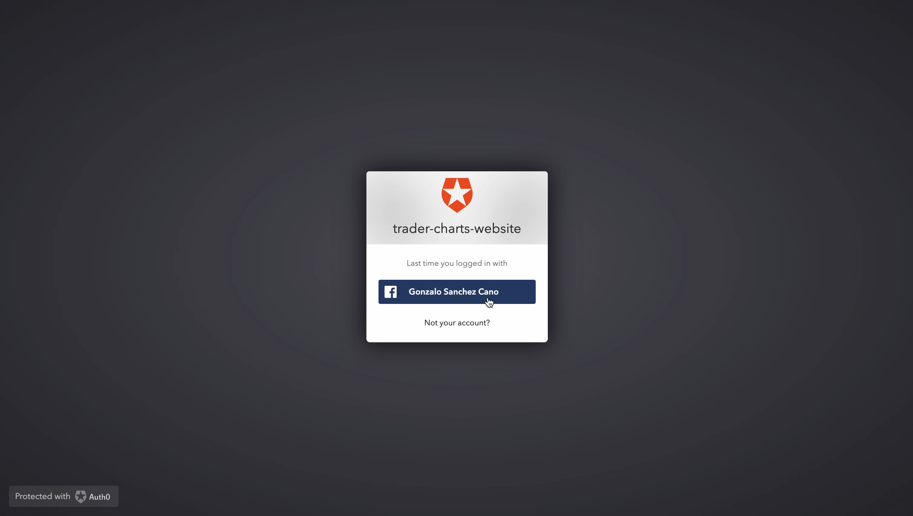

* Charts section:

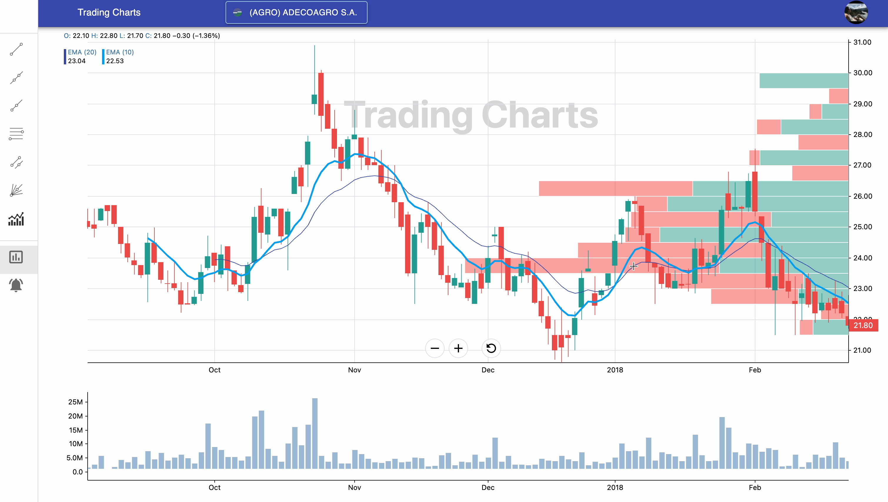

* Alerts section:

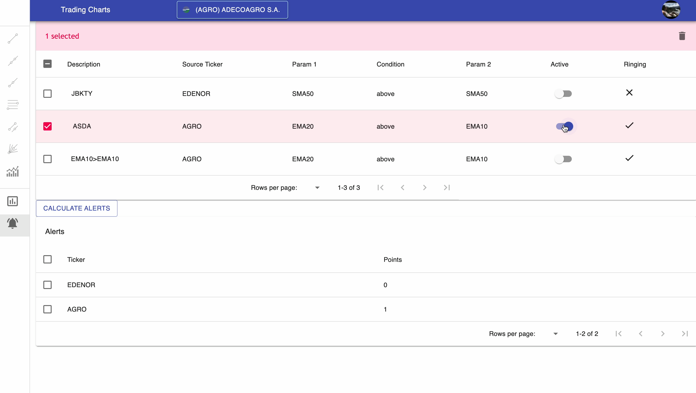

* Alerts editable details:

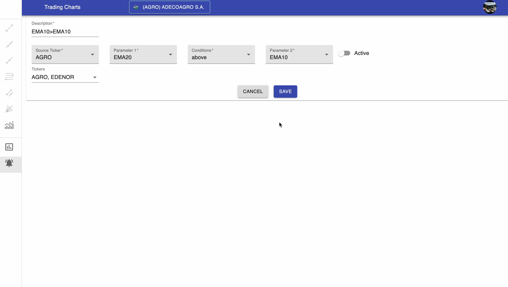
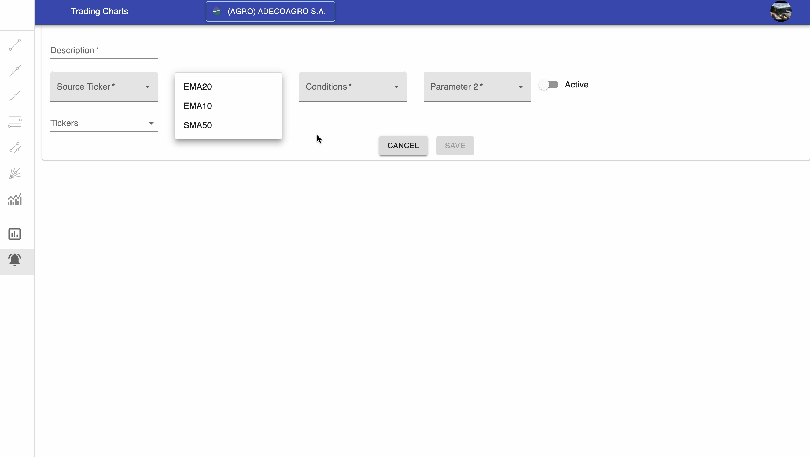
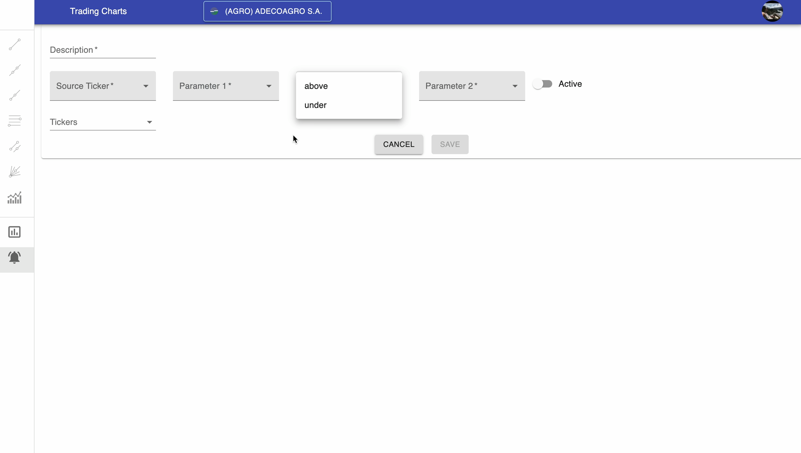

* Profile Menu:

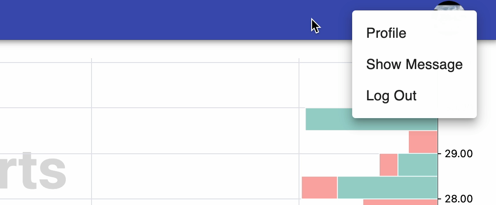

* Tickers search box:

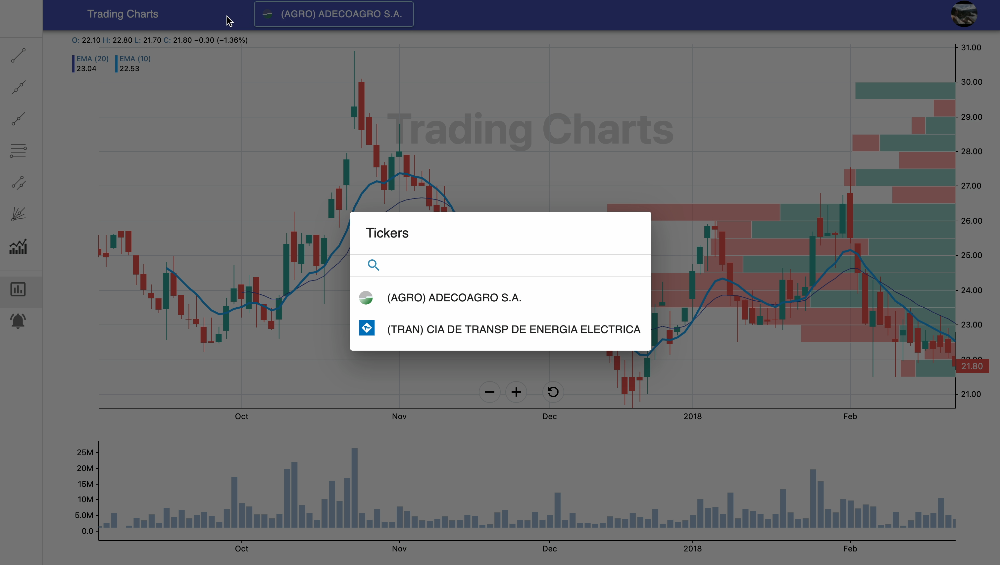

* Interactive components of Fibonacci retracements and parallel channels:

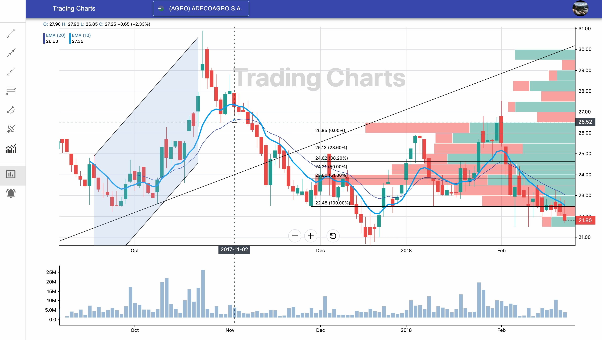

* Interactive components of Trend lines:

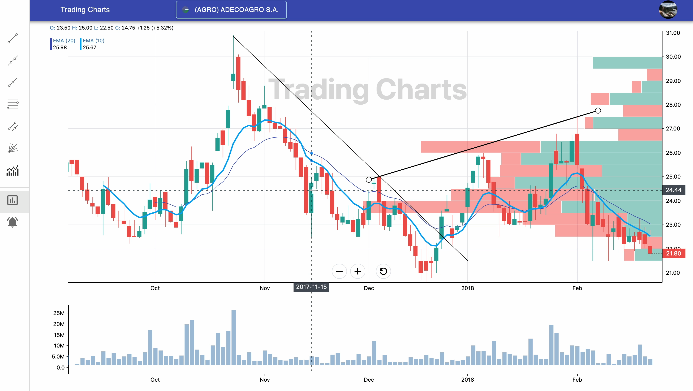

* Interactive components of Rays and Extended lines:

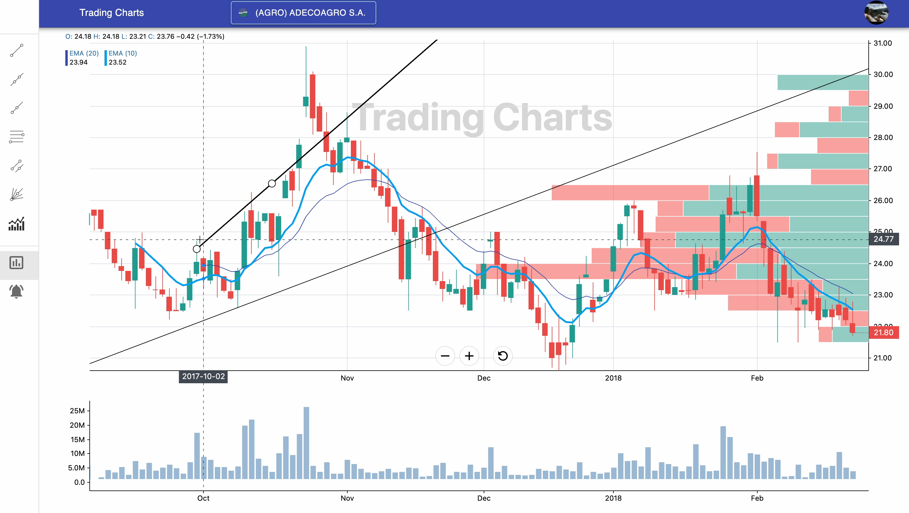

* Gann fans interactive component:

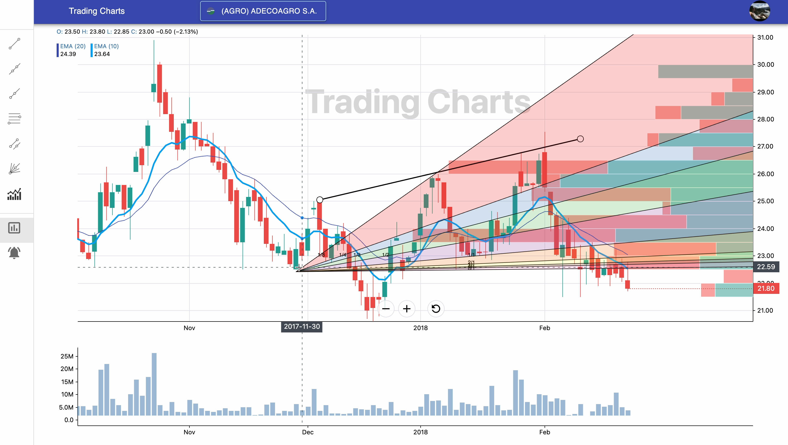

* Gann fans interactive component:

* Indicator's search box:

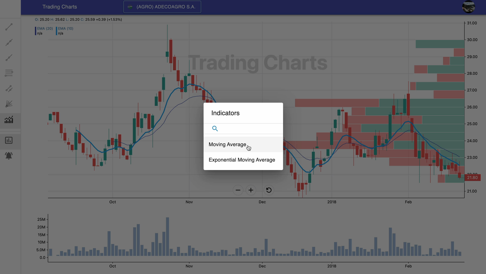

* Indicator's details:

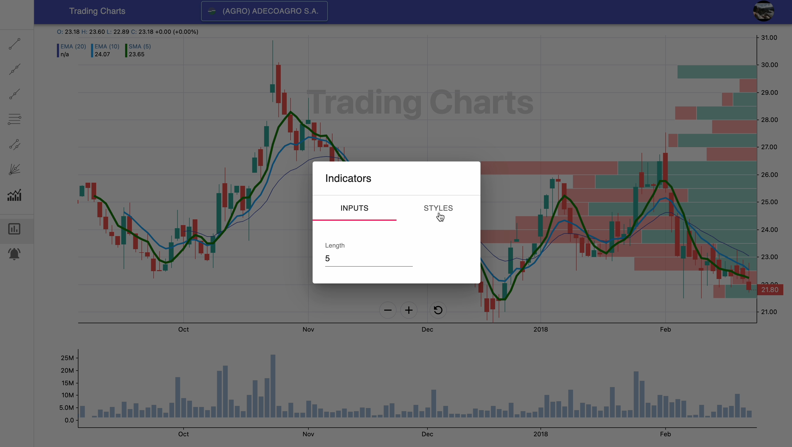

* Indicator's color picker:

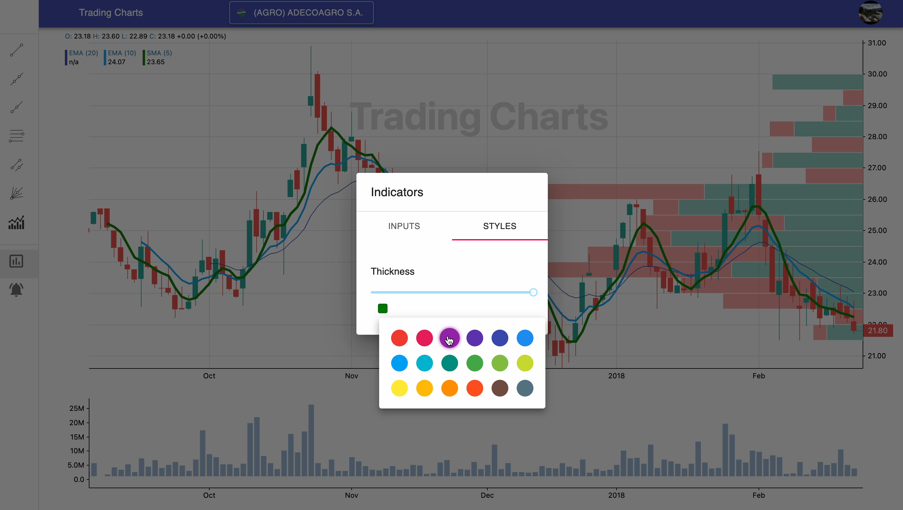

## Contributors ✨

Thanks goes to these wonderful people:

<table>
  <tbody>
    <tr>
      <td align="center" valign="top" width="14.28%"><a href="https://github.com/sgonzaloc"> <b>Gonzalo Sanchez Cano</b></a></td>
    </tr>
  </tbody>
</table>
